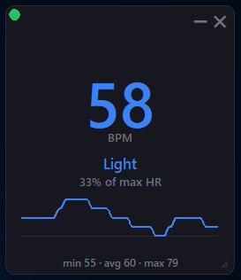

# HeartRateWidget

A small, floating, always-on-top desktop widget that shows your live heart rate from any Bluetooth LE heart rate device (Fitbit Air, chest straps, etc.).

   
 
 

## Features
- Compact floating widget (no title bar)
- Drag to move, resize, minimize, or close
- Color-coded zones (Light / Moderate / Vigorous / Peak)
- Automatic unpair of stale Bluetooth connections on Windows
- Works with any standard BLE Heart Rate device

## Download (Windows)
1. Go to the [Releases](https://github.com/LordPerkyy/HeartRateWidget/releases) page
2. Download the latest `HeartRateWidget.exe`
3. Run it (Windows may show a SmartScreen warning the first time - click "More info" → "Run anyway")

## Notes
The device can only stream to one client at a time. Close Google Fit / Fitbit app on your phone first.
On Windows the app automatically tries to unpair any stale "Fitbit" connection so scanning works reliably.
Change DEFAULT_MAX_HR near the top of the script to set your own max heart rate.


## Run from source
```bash
pip install bleak
python widget_heart_rate_6.0.py

optional arguments
python widget_heart_rate_6.0.py --max-hr 190
python widget_heart_rate_6.0.py --name Fitbit
python widget_heart_rate_6.0.py --console
